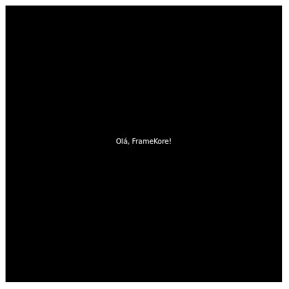

# Configurando Area de Trabalho...
---

No momento a FrameKore está em fase beta então não possui uma biblioteca oficial que possa adicionar normalmente ao seu projeto, então para começar um novo projeto teremos que clonar a engine pelo repositório do github.

Repositório: [FrameKore-Engine](https://github.com/Fkaique/FrameKore-Engine)

Para começar, clone o repositório.
- HTTP: `git clone https://github.com/Fkaique/FrameKore-Engine.git` 
- SSH: `git clone git@github.com:Fkaique/FrameKore-Engine.git`

Depois de clonar você verá uma estrutura de pastas como essa.

```
FrameKore-Engine
    - example
        PlataformGame2D
    - packages
        FrameKore-Engine
    LICENSE
    package.json
    ...
    
```

Para que consiga iniciar um projeto e usar a engine serão necessarias apenas algumas configurações a mais.
Para isso, entre na pasta raiz
- `cd FrameKore-Engine`

Instale as dependências do projeto.
- `pnpm i`

E faça a build da Engine.
- `pnpm build:engine`

Com isso a engine já está preparada para ser usada.

# Começando Novo Projeto.
---

Para começarmos usaremos o vite para facilitar o gerenciamento do projeto.

Começe criando e entrando na pasta do novo projeto.

```
mkdir <nome-do-projeto>
cd <nome-do-projeto>
```

E então crie o projeto vite:
```
pnpm create vite@latest
```

E adicione a Engine ao projeto:
```
pnpm add @framekore-engine/core --workspace
```
Com isso finalmente podemos começar a codar

A estrutura base para um projeto é apenas a instanciação de uma Engine e uma Cena.
::: info Obs:
A Cena (Scene) é onde será estruturada uma "fase" usando GameObjects (Inimigos, Player, Paredes...) e quaisquer outros elementos.
:::


```js [JavaScript]
import { Engine, Scene } from "@framekore-engine/core"

const canvas = document.createElement('canvas')
document.body.append(canvas)
canvas.width = 400
canvas.height = 400

const engine = new Engine(canvas)

// Exemplo de Cena
class Level extends Scene {
    init() { 
    }

    update(dt) {
    }

    draw(ctx){
        ctx.fillStyle = "black"
        ctx.fillRect(0,0,canvas.width, canvas.height)
        ctx.fillStyle = "white"
        ctx.textAlign = "center"
        ctx.fillText("Olá FrameKore", canvas.width/2, canvas.height/2)
    }
}

// Alterando Cena atual 
engine.setScene(new Level(engine))

```

Com isso você pode já testar seu projeto.

`pnpm dev`

No terminal aparecerá o link para abrir o teste no navegador.

`http://localhost:..../`

Ao acessar o link você terá algo assim.



<br>

---

<br>

Agora precisamos criar alguns objetos para preencher a Cena.